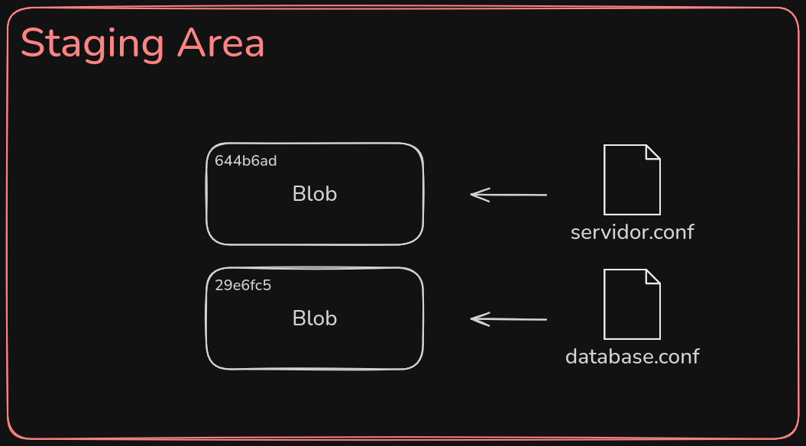
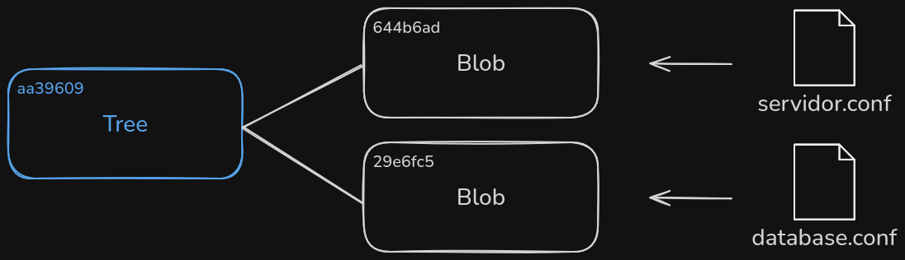
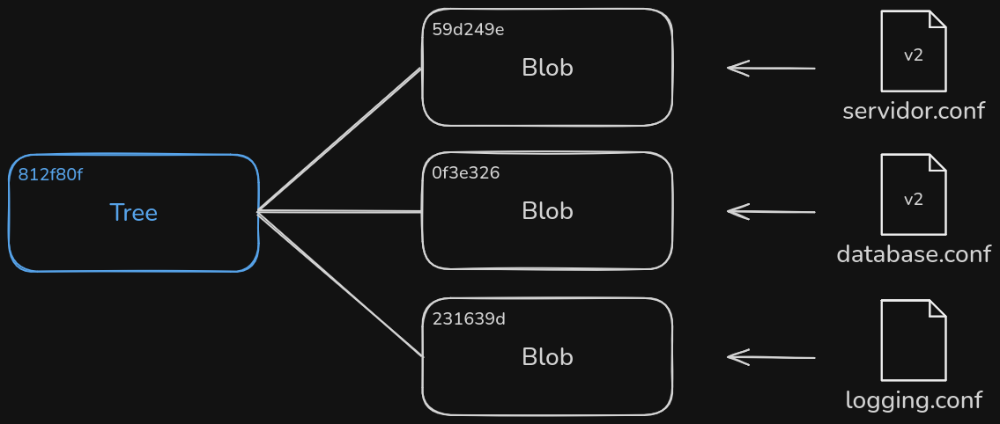
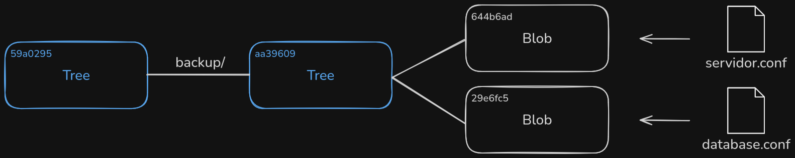
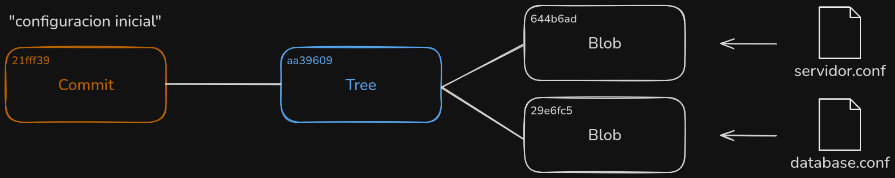
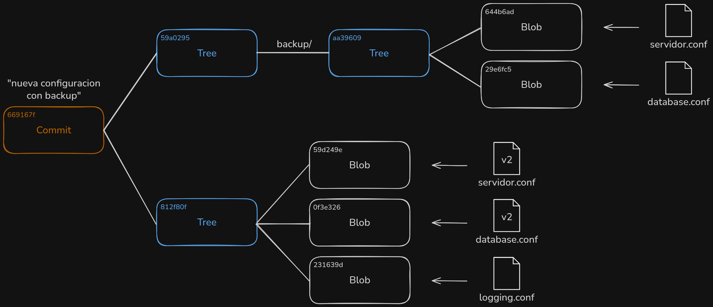

# Lab 04 — Construir un repo a mano

> ¿Prefieres leerlo en el navegador? Este mismo README está en [GitHub](https://github.com/madmti/git-workshop-labs/blob/main/labs/04-repo-a-mano/README.md).

## Objetivo

Construir la base de datos de objetos de Git **a mano**, con comandos de
fontanería (`hash-object`, `cat-file`, `update-index`, `write-tree`,
`read-tree`, `commit-tree`), trabajando por debajo del directorio de
trabajo: vas a crear blobs, trees y commits encadenados **sin** usar
`git add` ni `git commit`.

> [!TIP]
> Se recomienda anotar los hashes en `hashes.txt` a medida que los vas
> generando: casi todos se van a necesitar en steps posteriores y así
> evitas volver a calcularlos.

## Antes de empezar

```bash
./init.sh
```

Esto crea la carpeta `mi-repo/` con un repositorio ya inicializado
(`git init`) y con tu identidad de Git configurada a nivel local. A
diferencia de los labs anteriores, **no deja ningún archivo de
proyecto**: el proyecto (archivos de configuración) lo vas a crear tú
durante los steps y a convertir en objetos Git a mano.

## Steps

El verificador es acumulativo: `./verify.sh N` corre los checks desde el
step 1 hasta el N. `./verify.sh` sin argumentos corre todos los steps.

Todos los steps se ejecutan dentro de `mi-repo/`:

```bash
cd mi-repo
```

### Step 1 — Alias locales

Los comandos de fontanería son crudos, así que vamos a configurar unos
alias locales para que sean más cómodos:

```bash
git config --local alias.guardar-blob "hash-object -w --stdin"
git config --local alias.ver-objeto "cat-file -p"
git config --local alias.tipo-objeto "cat-file -t"
git config --local alias.agregar-archivo "update-index --add --cacheinfo"
git config --local alias.guardar-arbol "write-tree"
git config --local alias.anidar-arbol "read-tree"
git config --local alias.crear-commit "commit-tree"
```

De aquí en adelante vas a usar estos alias en vez de los comandos
completos.

### Step 2 — Blob de `servidor.conf` (v1)

El proyecto que vas a modelar tiene archivos de configuración. Abre tu
editor de código (por ejemplo `code .`) y crea la primera versión de
`servidor.conf` con exactamente este contenido:

```
host=localhost
port=8080
```

> Git hashea el contenido del archivo tal cual, incluido el salto de
> línea final. Casi todos los editores lo agregan al guardar; si
> `verify.sh` falla, revisa que el archivo no tenga líneas o espacios de
> más.

Guarda su contenido como un objeto **blob** en la base de datos de Git.
La redirección `< servidor.conf` alimenta el comando con el contenido
del archivo:

```bash
git guardar-blob < servidor.conf
```

El comando imprime un _checksum_ SHA-1 de 40 caracteres. Cópialo y
compruébalo con tus alias:

```bash
git ver-objeto <hash>       # muestra el contenido
git tipo-objeto <hash>      # muestra el tipo: blob
```

> Guárdate ese hash: lo vas a necesitar en el step 3. Si lo pierdes,
> vuelve a ejecutar `git guardar-blob < servidor.conf` (devuelve el
> mismo hash, porque el contenido es idéntico).


### Step 3 — Tree `config-viejo`

En tu editor, crea un segundo archivo de configuración, `database.conf`,
con su versión 1:

```
driver=sqlite
path=./data/app.db
```

Guarda su contenido como blob:

```bash
git guardar-blob < database.conf
```


Ya tienes dos blobs en la base de datos: el de `servidor.conf` (step 2) y
el de `database.conf`. Ahora arma el primer _snapshot_: agrega ambos al
área de preparación (index) indicando **modo, hash y nombre**:

```bash
git agregar-archivo 100644 <hash-servidor> servidor.conf
git agregar-archivo 100644 <hash-database> database.conf
```

`100644` es el modo de un archivo normal (como viste en clase). El alias
`agregar-archivo` usa `--cacheinfo`, que inserta una entrada en el index
usando el hash del objeto, sin depender de un archivo en el working tree.



Ahora escribe el área de preparación como un objeto **tree**:

```bash
git guardar-arbol
```

El hash impreso es el del tree `config-viejo`. Cópialo.



### Step 4 — Tree `config-nuevo`

La configuración evolucionó. En tu editor, actualiza `servidor.conf` y
`database.conf`, y crea un archivo nuevo, `logging.conf`, con estos
contenidos exactos:

`servidor.conf`:

```
host=localhost
port=9090
```

`database.conf`:

```
driver=postgres
path=db.example.com:5432
```

`logging.conf` (nuevo):

```
level=info
output=stdout
```

Convierte cada archivo en un blob:

```bash
git guardar-blob < servidor.conf
git guardar-blob < database.conf
git guardar-blob < logging.conf
```

Actualiza el index con las versiones nuevas (el `--add` del alias
reemplaza las entradas que ya existen y agrega las nuevas):

```bash
git agregar-archivo 100644 <hash-servidor-v2> servidor.conf
git agregar-archivo 100644 <hash-database-v2> database.conf
git agregar-archivo 100644 <hash-logging> logging.conf
```

Escribe el nuevo tree:

```bash
git guardar-arbol
```

El hash impreso es el del tree `config-nuevo`.



### Step 5 — Anidar `config-viejo` en `backup/`

Vas a incluir el snapshot viejo como una subcarpeta `backup/` dentro del
nuevo. Usa `read-tree` con `--prefix` para meter el tree `config-viejo`
en el index como si fuera un subdirectorio:

```bash
git anidar-arbol --prefix=backup/ <hash-config-viejo>
git guardar-arbol
```

El hash impreso es el tree final, con `backup/` anidado.



### Step 6 — Primer commit (sin padre)

El tree `config-viejo` es el primer snapshot. Crea un objeto commit que
lo apunte. `commit-tree` lee el mensaje desde la entrada estándar:

```bash
echo 'configuracion inicial' | git crear-commit <hash-config-viejo>
```

El hash impreso es el del primer commit. Cópialo.



### Step 7 — Segundo commit (con padre)

El tree final (con `backup/`) es el segundo snapshot. Encadénalo al
primer commit con `-p`:

```bash
echo 'nueva configuracion con backup' | git crear-commit <hash-tree-final> -p <hash-primer-commit>
```

¡Listo! Construiste dos commits y todo el grafo de objetos a mano.



Si quieres verlo funcionando como en la clase:

```bash
git log --stat <hash-segundo-commit>
find .git/objects -type f
```

> Si ejecutas `git status`, vas a ver archivos en el index pero "no
> commits" en ninguna rama, y `backup/` marcado como "deleted": los
> commits que creaste están sueltos en la base de datos de objetos (sin
> ramas que los apunten) y la carpeta `backup/` solo existe dentro de
> los trees y del index, no como carpeta real en disco. Es exactamente
> el punto de este lab: trabajamos por debajo del working tree y de las
> referencias.

## Verificar tu progreso

Desde la carpeta del lab (no desde `mi-repo/`):

```bash
./verify.sh        # corre todos los steps
./verify.sh N        # corre los steps aplicables hasta el step N
```

Si algún check falla, el script te dice exactamente qué falta.
