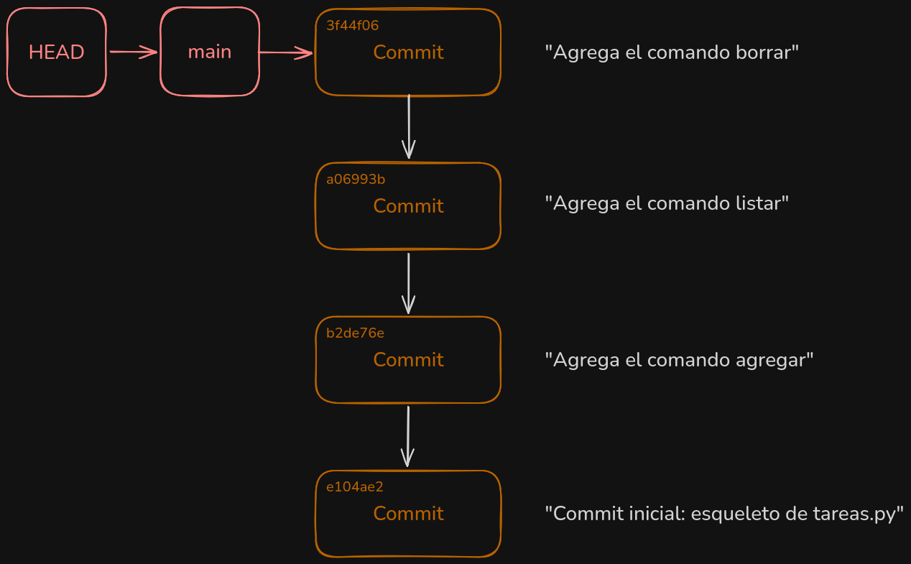
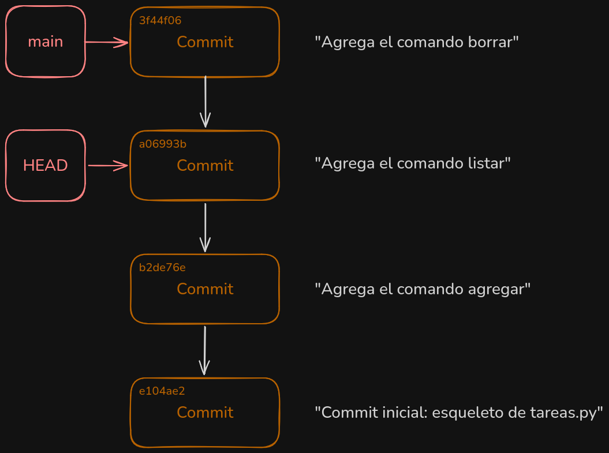
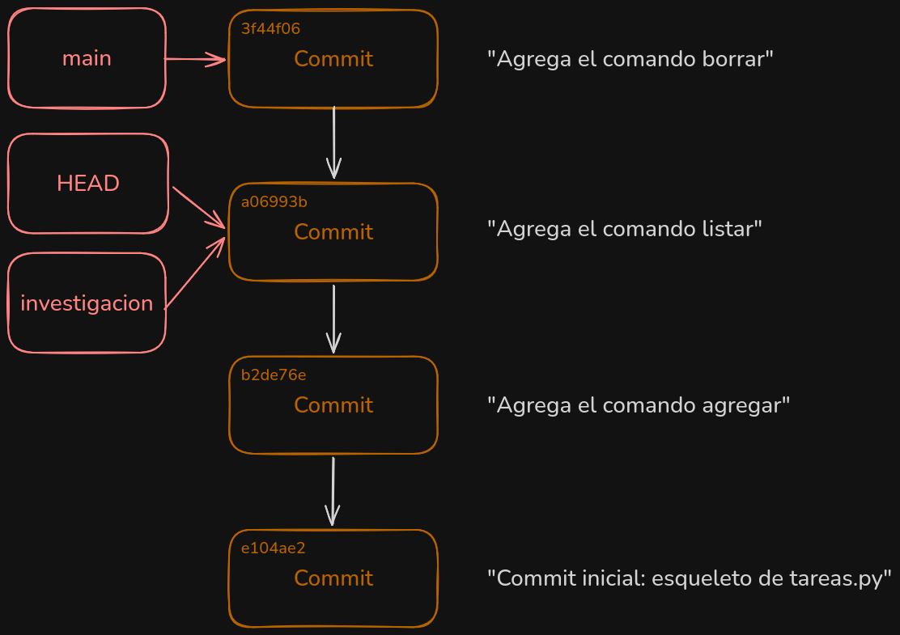
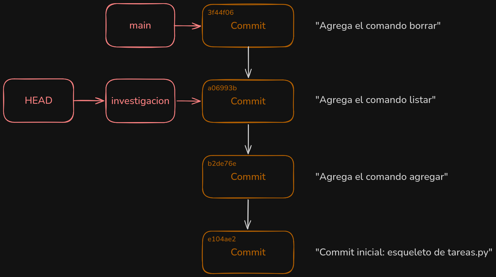
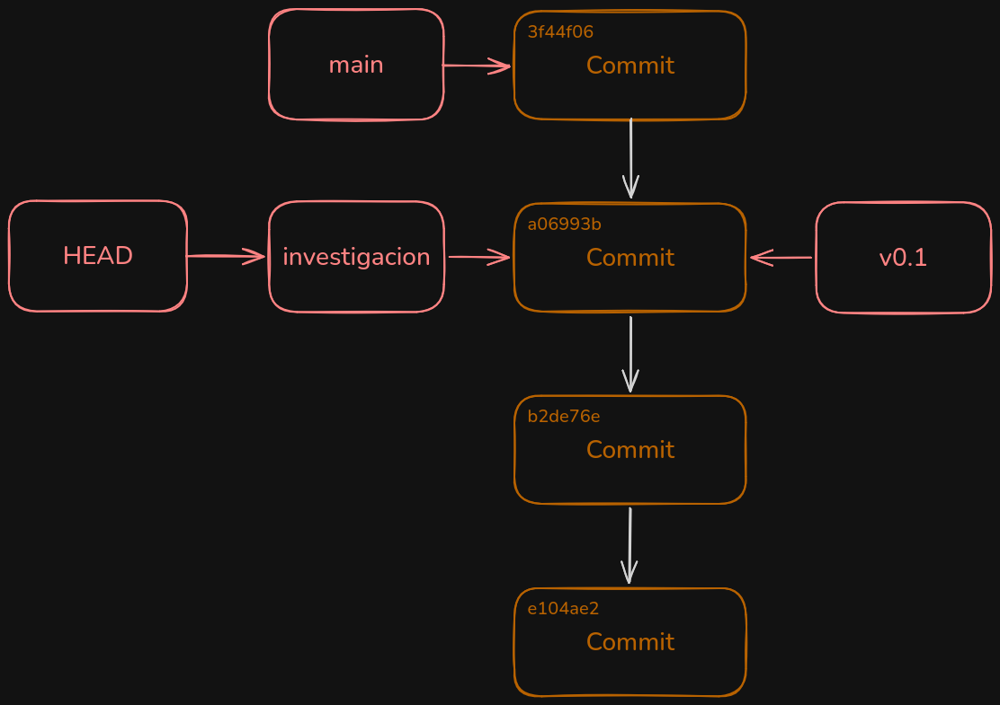
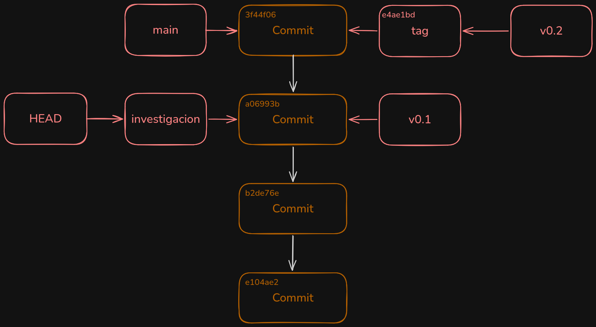

# Lab 05 — Referencias, HEAD y etiquetas

> ¿Prefieres leerlo en el navegador? Este mismo README está en [GitHub](https://github.com/madmti/git-workshop-labs/blob/main/labs/05-referencias-head-tags/README.md).

## Objetivo

Entender que una rama es solo un archivo con un _checksum_ SHA-1, que el
`HEAD` es una referencia simbólica a una rama, y que las etiquetas son
referencias permanentes. Vas a crear ramas y etiquetas **a mano** con
fontanería (`update-ref`, `symbolic-ref`, `checkout`) y a verificar en
disco (`.git/refs/` y `.git/HEAD`) cómo cambia cada cosa a medida que
avanzas.

> [!TIP]
> Se recomienda anotar los hashes en `hashes.txt` (en la raíz del lab) a
> medida que los vas generando: el hash del commit bueno se reutiliza en
> los steps 1, 2 y 4, y el de `main` en el step 5.

## Antes de empezar

```bash
./init.sh
```

Esto crea la carpeta `proyecto/` con un repositorio ya inicializado
(`git init -b main`), con tu identidad configurada a nivel local y con 4
commits hechos en `main` que evolucionan `tareas.py`, un CLI de lista de
tareas. El archivo `hashes.txt` ya viene en la raíz del lab, listo para
que anotes los hashes a medida que los generás.

Todos los steps se ejecutan dentro de `proyecto/`:

```bash
cd proyecto
```

## Steps

El verificador es acumulativo: `./verify.sh N` corre los checks desde el
step 1 hasta el N. `./verify.sh` sin argumentos corre todos los steps.

### Step 1 — Explorar y moverse a una versión anterior

El equipo detectó un bug en el último commit de `main` (el comando
`borrar` de `tareas.py`). Vamos a ir a la última versión buena para
comparar.

Primero mira el historial:

```bash
git log --oneline
```

Hay 4 commits. El bug se introdujo en el último ("Agrega el comando
borrar"). El commit anterior, "Agrega el comando listar" (`main~1`), es
la última versión buena.

Ahora mira qué es una rama por dentro:

```bash
find .git/refs -type f
cat .git/refs/heads/main
cat .git/HEAD
```

`refs/heads/main` es un archivo cuyo contenido es el _checksum_ SHA-1 del
último commit de `main`. `HEAD` es una **referencia simbólica**: contiene
`ref: refs/heads/main`, un enlace a otra referencia, no un sha.



Obtén el sha del commit bueno y anótalo en `hashes.txt` (en la raíz del
lab, fuera de `proyecto/`):

```bash
git rev-parse main~1
```

Y muévete a esa versión:

```bash
git checkout <sha-del-commit-bueno>
```

Comprueba qué pasó con `HEAD`:

```bash
cat .git/HEAD
```

Ya no contiene `ref:`: ahora tiene el sha directamente. `HEAD` quedó
"desacoplado" de cualquier rama. Fíjate también que el working tree se
actualizó: `tareas.py` ahora es la versión vieja, sin el comando `borrar`
con el bug.



### Step 2 — Crear una rama con `git update-ref`

Vamos a guardar esta investigación en una rama, creándola desde el commit
anterior (igual que el `refs/heads/test` de la clase). No uses `git
branch` ni `git checkout -b`: crea la referencia con fontanería:

```bash
git update-ref refs/heads/investigacion <sha-del-commit-bueno>
```

Mira qué apareció en disco:

```bash
ls .git/refs/heads
cat .git/refs/heads/investigacion
git branch
```

`investigacion` nació apuntando al commit bueno, no al último de `main`.



### Step 3 — Fijar `HEAD` con `git symbolic-ref`

`git checkout -b` hace exactamente dos cosas por debajo: crear la
referencia y apuntar `HEAD` hacia ella. La referencia ya existe; falta
lo segundo. Hazlo sin `git checkout`, con fontanería:

```bash
git symbolic-ref HEAD refs/heads/investigacion
```

Verifícalo:

```bash
cat .git/HEAD
git status
```

`HEAD` vuelve a ser `ref: refs/heads/investigacion` y `git status` te
dice "On branch investigacion". Como el working tree ya coincidía con el
commit de esa rama, todo quedó consistente: acabas de reproducir
`git checkout -b investigacion` con sus dos mitades por separado.



### Step 4 — Etiqueta ligera

Vamos a marcar el commit bueno como `v0.1`. Una etiqueta ligera es
literalmente una referencia más, apuntando directo a un commit:

```bash
git update-ref refs/tags/v0.1 <sha-del-commit-bueno>
```

Mira lo que pasó en disco:

```bash
ls .git/refs/tags
cat .git/refs/tags/v0.1
git cat-file -t v0.1
```

`v0.1` apunta al commit bueno y su tipo es `commit`: etiqueta ligera.




### Step 5 — Etiqueta anotada

Ahora marca la versión final de `main` como `v0.2`, pero esta vez con
una etiqueta **anotada**: Git crea un objeto etiqueta (con tagger y
mensaje) y la referencia apunta a ese objeto, no al commit.

Anota el sha de `main` en `hashes.txt` y crea la etiqueta:

```bash
git rev-parse main
```

```bash
git tag -a v0.2 <sha-de-main> -m "Version 0.2: release de main"
```

Comprueba la diferencia:

```bash
ls .git/refs/tags
cat .git/refs/tags/v0.2
git cat-file -t v0.2
```

`v0.2` apunta a un objeto de tipo `tag`, distinto del commit. Lée el
objeto etiqueta:

```bash
git cat-file -p <sha-del-objeto-tag>
```

Ves el campo `object <sha-de-main>` con `type commit`: el objeto etiqueta
envuelve al commit agregándole tagger y mensaje.

Resumen de lo que viste: ramas y etiquetas son archivos con shas dentro
de `.git/refs/`; `HEAD` es una referencia simbólica que apunta a una
rama; y una etiqueta anotada agrega un objeto intermedio entre la
referencia y el commit.



## Verificar tu progreso

Desde la carpeta del lab (no desde `proyecto/`):

```bash
./verify.sh        # corre todos los steps
./verify.sh N        # corre los steps aplicables hasta el step N
```

Si algún check falla, el script te dice exactamente qué falta.
