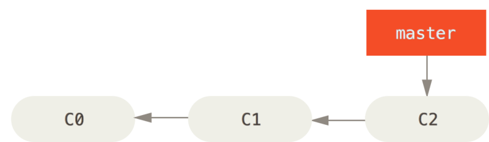
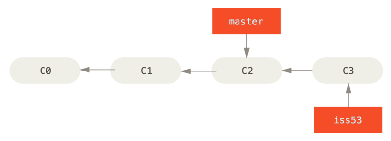
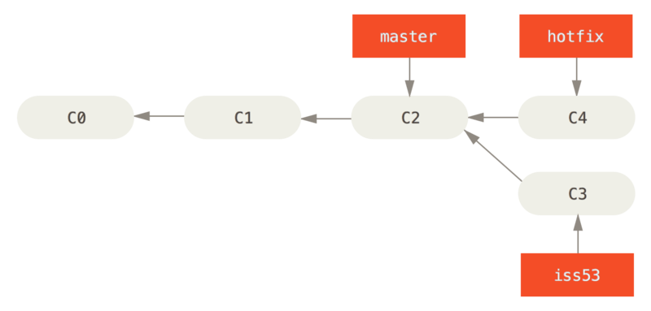
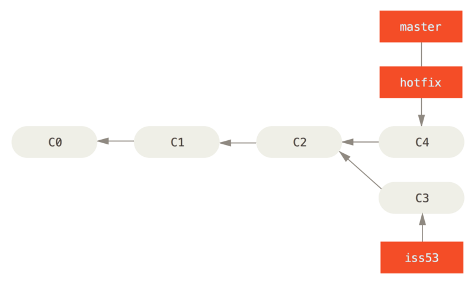
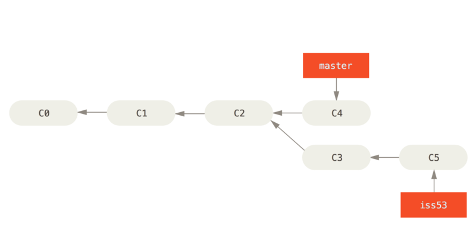
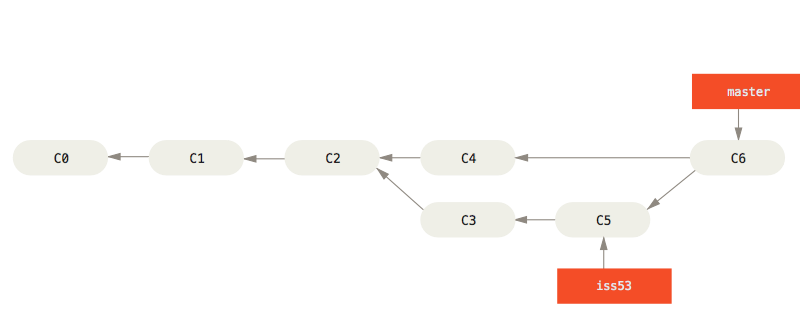

# Lab 07 — Ramas y fusiones

> ¿Prefieres leerlo en el navegador? Este mismo README está en [GitHub](https://github.com/madmti/git-workshop-labs/blob/main/labs/07-ramas-y-fusiones/README.md).

## Objetivo

Practicar el flujo completo de ramificación y fusión sobre un sitio web
chico: crear ramas con `git checkout -b`, fusionar con **fast-forward**
(cuando una rama desciende directamente de la otra), borrar ramas ya
fusionadas con `git branch -d` y cerrar con un **merge recursivo**, que
es el que genera un _merge commit_ (un commit con 2 padres).

## Antes de empezar

```bash
./init.sh
```

Esto crea la carpeta `proyecto/` con un repositorio ya inicializado
(`git init -b main`), tu identidad configurada a nivel local y 3 commits
en `main` que van armando un mini sitio web estático (`index.html` +
`css/estilos.css` + `README.md`).

Todos los steps se ejecutan dentro de `proyecto/`:

```bash
cd proyecto
```



## Steps

El verificador es acumulativo: `./verify.sh N` corre los checks aplicables
hasta el step N. `./verify.sh` sin argumentos corre todos los steps.

### Step 1 — Crear la rama `iss53` y agregar el footer

Estás trabajando en el issue `#53`. Crea una rama nueva y salta a ella en
un solo paso:

```bash
git checkout -b iss53
```

Abre `index.html` en tu editor de código (por ejemplo `code .`) y,
**reemplazando** el comentario `<!-- TODO (step 1) -->`, pega este footer:

```html
<footer>
  <p>Tienda Online</p>
  <!-- TODO (step 4): agrega el copyright -->
</footer>
```

Ahora guarda y confirma:

```bash
git add index.html
git commit -m "Agrega el footer [issue 53]"
```

La rama `iss53` quedó un commit adelante de `main`.



### Step 2 — El hotfix urgente

Recibes una llamada: el email de contacto del sitio está roto y hay que
corregirlo ya, sin mezclarlo con el trabajo del issue `#53`. Vuelve a
`main` y crea una rama de corrección:

```bash
git checkout main
git checkout -b hotfix
```

> [!TIP]
> Para poder cambiar de rama debes tener el working tree limpio (todo
> committeado). Si algo quedó sin confirmar, `git checkout` no te va a
> dejar saltar.

Abre `index.html` y corrige el email de contacto: reemplaza
`email.support@github.com` por `support@github.com`.

Guarda y confirma:

```bash
git add index.html
git commit -m "Corrige el email de contacto"
```



### Step 3 — Fast-forward de `hotfix`

Vuelve a `main` y fusiona la corrección:

```bash
git checkout main
git merge hotfix
```

Deberías ver algo así (los shas cambian en tu repo):

```
Updating f42c576..3a0874c
Fast-forward
 index.html | 2 +-
 1 file changed, 1 insertion(+), 1 deletion(-)
```



Fue un **fast-forward**: como `main` era ancestro directo de `hotfix`, Git
no creó ningún commit nuevo, simplemente movió la rama `main` hacia
adelante. Ya no necesitas la rama `hotfix`, bórrala:

```bash
git branch -d hotfix
```

`git branch -d` permite borrar ramas cuyo contenido ya está fusionado.

### Step 4 — Terminar el trabajo en `iss53`

Vuelve al trabajo del issue `#53`:

```bash
git checkout iss53
```

Abre `index.html` y, **reemplazando** el comentario
`<!-- TODO (step 4): agrega el copyright -->`, pega el copyright:

```html
  <p>&copy; 2026 Tienda Online</p>
```

Guarda y confirma:

```bash
git add index.html
git commit -m "Agrega el copyright del footer [issue 53]"
```

Observa que ahora `iss53` está 2 commits adelante de `main` (el footer y el
copyright):

```bash
git log --graph --oneline --decorate --all
```



### Step 5 — Merge recursivo de `iss53`

El issue `#53` está completo. Vuelve a `main` y fusiona:

```bash
git checkout main
git merge iss53 -m "Fusiona el issue 53"
```

> [!TIP]
> Pasamos `-m` para indicar el mensaje del commit de fusión. Sin él, Git
> abriría el editor de mensajes que tengas configurado (vim, nano, VS
> Code...) para que lo escribas a mano; con `-m` no se abre nada.

Esta fusión es distinta a la del hotfix: ahora `main` y `iss53`
**divergieron** (cada una tiene commits que la otra no tiene). Git no
puede avanzar `main` directamente: crea un commit nuevo de fusión que
combina ambas historias. Ese commit tiene **2 padres**.

```
Merge made by the 'ort' strategy.
```

Fíjate en el historial:

```bash
git log --graph --oneline --decorate --all
```



Deberías ver el commit de fusión en la punta de `main`, con las dos ramas
convergiendo. Ya puedes borrar `iss53`:

```bash
git branch -d iss53
```

Comprueba que solo queda `main`:

```bash
git branch -v
```

## Verificar tu progreso

Desde la carpeta del lab (no desde `proyecto/`):

```bash
./verify.sh        # corre todos los steps
./verify.sh N        # corre los steps aplicables hasta el step N
```

Si algún check falla, el script te dice exactamente qué falta.
